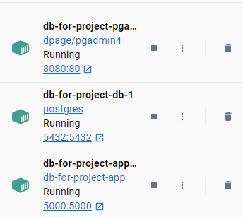
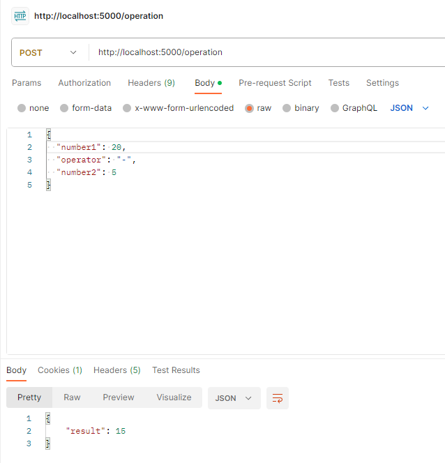

## Flask Basics

Bu proje, Pgadmin ve Postgresql için docker compose ile kaldırılabilen 3 konteyner ve iki basit Flask endpoint içeren bir uygulamadır. Temel seviye bir örnek olması için tasarlanmıştır.

### Docker'ı Çalıştırmak

**Kurulum:**

- Docker kurulu değilse, Docker kurulum rehberine: [https://www.docker.com/get-started](https://www.docker.com/get-started) göz atın.

**Komutlar:**

1. `docker-compose build` ile konteynerleri oluşturun.
2. `docker-compose up` ile çalıştırın.
3. `docker-compose stop` ile durdurun.
4. `docker ps -a` ile konteynerleri kontrol edin.
<figure><figcaption></figcaption></figure>

**Pgadmin arayüzü:**

1. Pgadmin server adresi (muhtemelen 172.19.0.1 veya 172.20.0.1) ile servera bağlanın.
2. Kullanıcı adı, şifre ve db'ye "postgres" yazın.
3. "http://localhost:8080/" adresine gidin.
4. Kullanıcı adı ve şifre:

    **your_email@example.com**

    **your_password**

### Endpointleri Test Etmek

* **GET isteği:** `localhost:5000/hello`
* **POST isteği:** `http://localhost:5000/operation` adresine 2 rakam ve 1 işlem göndererek (örneğin: {"number1": 10, "operator": "+", "number2": 5}).
<figure><figcaption></figcaption></figure>

